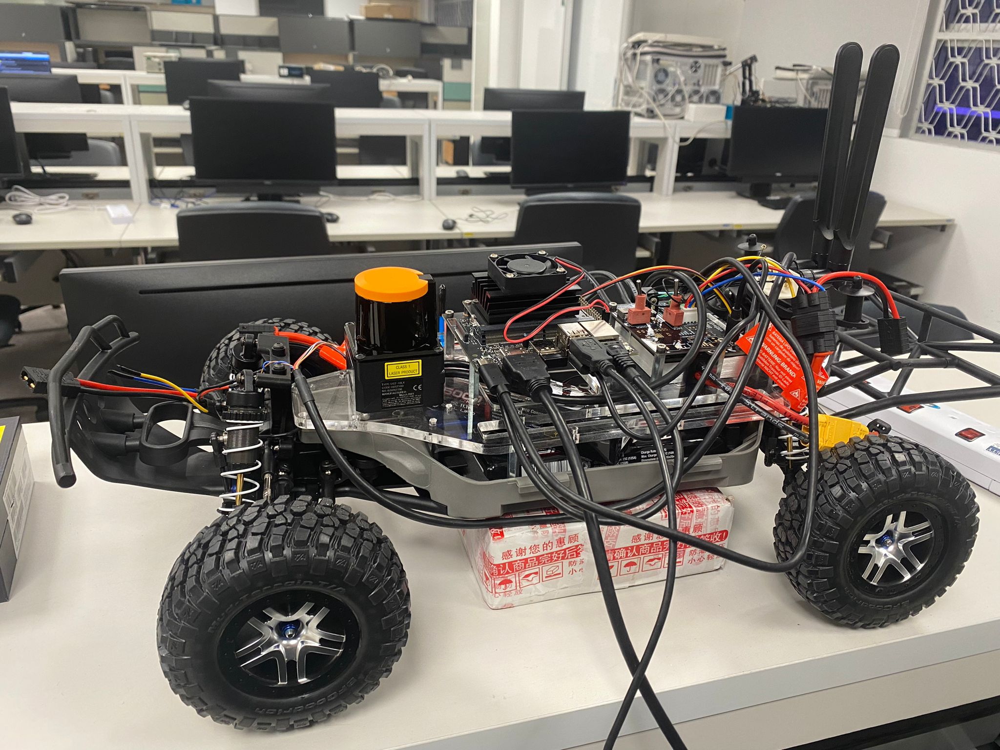

<a name="readme-top"></a>

[![Contributors][contributors-shield]][contributors-url]
[![Forks][forks-shield]][forks-url]
[![Stargazers][stars-shield]][stars-url]
[![Issues][issues-shield]][issues-url]
[![MIT License][license-shield]][license-url]


<!-- PROJECT LOGO -->
<br />
<div align="center">
  <a href="https://github.com/yqchau/pseudo-vision">
    
  </a>

<h3 align="center">Pseudo Vision</h3>

  <p align="center">
    This repository presents a way to apply LiDAR sensor to a vision based algorithm, by passing the occupancy grid as an image input.
    <br />
    <a href="https://github.com/yqchau/pseudo-vision"><strong>Explore the docs »</strong></a>
    <br />
    <br />
    <a href="https://github.com/yqchau/pseudo-vision">View Demo</a>
    ·
    <a href="https://github.com/yqchau/pseudo-vision/issues">Report Bug</a>
    ·
    <a href="https://github.com/yqchau/pseudo-vision/issues">Request Feature</a>
  </p>
</div>


<!-- TABLE OF CONTENTS -->
<details>
  <summary>Table of Contents</summary>
  <ol>
    <li>
      <a href="#about-the-project">About The Project</a>
      <ul>
        <li><a href="#built-with">Built With</a></li>
      </ul>
    </li>
    <li>
      <a href="#getting-started">Getting Started</a>
      <ul>
        <li><a href="#prerequisites">Prerequisites</a></li>
        <li><a href="#installation">Installation</a></li>
      </ul>
    </li>
    <li><a href="#usage">Usage</a></li>
    <li><a href="#contributing">Contributing</a></li>
    <li><a href="#license">License</a></li>
    <li><a href="#contact">Contact</a></li>
    <li><a href="#acknowledgments">Acknowledgments</a></li>
  </ol>
</details>


<!-- ABOUT THE PROJECT -->
## About The Project


Above shows the visualizations of the model layers when the autonomous vehicle is making a decision.

<p align="right">(<a href="#readme-top">back to top</a>)</p>


### Built With
* [![PyTorch][torch]][torch-url]
* 
* 


<p align="right">(<a href="#readme-top">back to top</a>)</p>


<!-- GETTING STARTED -->
## Getting Started

### Prerequisites


* [Python 3.8](https://www.python.org/downloads/)
* [ROS Noetic](http://wiki.ros.org/noetic/Installation)
* [F1Tenth Simulator](https://github.com/f1tenth/f1tenth_simulator)

### Installation
1. Clone the repo
   ```sh
   git clone https://github.com/yqchau/pseudo-vision.git
   ```
2. Install Python Packages
   ```sh
   pip install -r requirements.txt
   ```
3. Edit the configurations in `config.yaml` to select the correct model
   ```yaml
    timm:
      arch: "mobilenetv2_100"
      transfer_learning: false
   ```

<p align="right">(<a href="#readme-top">back to top</a>)</p>


<!-- USAGE EXAMPLES -->
## Usage

Use this space to show useful examples of how a project can be used. Additional screenshots, code examples and demos work well in this space. You may also link to more resources.

### Launching
1. Compile the codes
   ```sh
   catkin_make
   source devel/setup.bash
   ```
2. Launching the navigation node
   ```sh
   roslaunch pseudo-vision pvision_timm_nav.launch
   ```

<p align="right">(<a href="#readme-top">back to top</a>)</p>


<!-- CONTRIBUTING -->
## Contributing

Contributions are what make the open source community such an amazing place to learn, inspire, and create. Any contributions you make are **greatly appreciated**.

If you have a suggestion that would make this better, please fork the repo and create a pull request. You can also simply open an issue with the tag "enhancement".
Don't forget to give the project a star! Thanks again!

1. Fork the Project
2. Create your Feature Branch (`git checkout -b feature/AmazingFeature`)
3. Commit your Changes (`git commit -m 'Add some AmazingFeature'`)
4. Push to the Branch (`git push origin feature/AmazingFeature`)
5. Open a Pull Request

<p align="right">(<a href="#readme-top">back to top</a>)</p>


<!-- LICENSE -->
## License

Distributed under the MIT License. See `LICENSE.txt` for more information.

<p align="right">(<a href="#readme-top">back to top</a>)</p>


<!-- CONTACT -->
## Contact

Your Name - [@chauyuanqi](https://twitter.com/chauyuanqi) - yuanqichau@gmail.com

Project Link: [https://github.com/yqchau/pseudo-vision](https://github.com/yqchau/pseudo-vision)

<p align="right">(<a href="#readme-top">back to top</a>)</p>


<!-- ACKNOWLEDGMENTS -->
## Acknowledgments

* [F1Tenth Developers](https://f1tenth.org)
* [PyTorch Open Source Community](https://pytorch.org)
* [ROS Open Source Community](http://wiki.ros.org/Documentation)

<p align="right">(<a href="#readme-top">back to top</a>)</p>


<!-- MARKDOWN LINKS & IMAGES -->
<!-- https://www.markdownguide.org/basic-syntax/#reference-style-links -->
[contributors-shield]: https://img.shields.io/github/contributors/yqchau/pseudo-vision.svg?style=for-the-badge
[contributors-url]: https://github.com/yqchau/pseudo-vision/graphs/contributors
[forks-shield]: https://img.shields.io/github/forks/yqchau/pseudo-vision.svg?style=for-the-badge
[forks-url]: https://github.com/yqchau/pseudo-vision/network/members
[stars-shield]: https://img.shields.io/github/stars/yqchau/pseudo-vision.svg?style=for-the-badge
[stars-url]: https://github.com/yqchau/pseudo-vision/stargazers
[issues-shield]: https://img.shields.io/github/issues/yqchau/pseudo-vision.svg?style=for-the-badge
[issues-url]: https://github.com/yqchau/pseudo-vision/issues
[license-shield]: https://img.shields.io/github/license/yqchau/pseudo-vision.svg?style=for-the-badge
[license-url]: https://github.com/yqchau/pseudo-vision/blob/master/LICENSE.md
[linkedin-shield]: https://img.shields.io/badge/-LinkedIn-black.svg?style=for-the-badge&logo=linkedin&colorB=555
[linkedin-url]: https://linkedin.com/in/yuanqichau
[product-screenshot]: images/screenshot.png
[torch]: https://img.shields.io/badge/PyTorch-%23EE4C2C.svg?style=for-the-badge&logo=PyTorch&logoColor=white
[torch-url]: https://pytorch.org
